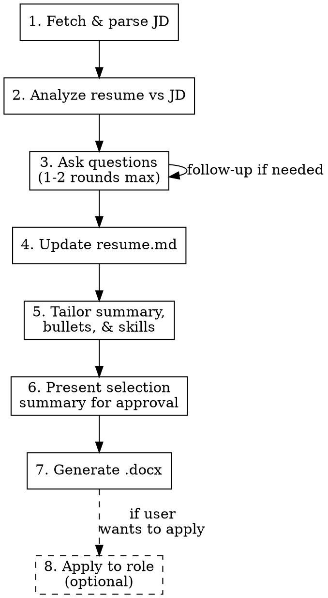

# Build Resume

Interactive workflow: analyze a job description against the user's master resume (`resume.md`), identify strongest matches, fill gaps through conversation, and generate an ATS-optimized 2-page Word document.

## Prerequisites

- `resume.md` in working directory (master resume — additive, never remove content)
- `generate_resume.py` in working directory
- `python-docx` installed (`pip3 install python-docx`)
- For Step 8 (Apply): `playwright` installed (`pip3 install playwright`), `apply_to_role.py` in working directory, Google Chrome installed

## Workflow



## Steps

### 1. Fetch Job Description

- `WebFetch` the URL. If it fails (login wall, JS), ask user to paste text.
- Extract: job title, company, location, hard requirements, preferred qualifications, responsibilities, keywords.
- Distinguish hard requirements from nice-to-haves.

### 2. Analyze Resume Match

Read `resume.md`. For each JD requirement, classify resume coverage:

| Category | Meaning |
|----------|---------|
| **Covered** | Strong bullet with quantified results directly maps to requirement |
| **Partial** | Related experience exists but weak fit or missing metrics |
| **Gap** | No relevant experience in resume.md |

Select top 3-5 strongest matches. Prioritize:
1. Quantified achievements directly mapping to JD requirements
2. Leadership/scope matching the role level
3. Recent experience (last 10-15 years)
4. Unique differentiators

### 3. Ask Questions (batch efficiently, 1-2 rounds max)

Present your analysis first, then ask ALL questions in one round, grouped:

**Gaps** — "The JD requires X. Do you have experience with this?"
- Only ask where the candidate might plausibly have experience
- Explain why it matters for the role

**Clarifications** — "Your bullet about X — should this rank higher for Y requirement?"
- Borderline items where ranking could go either way

**Deepening** — "For [bullet], can you share [specific metric/dollar amount/percentage]?"
- When a number would strengthen a selected or likely-selected bullet

**Additional skills** — "Do you have experience with [JD-mentioned tools/technologies/certs] not in your resume?"
- Cover tools, frameworks, certifications, domain expertise from JD

If the first round surfaces significant new info, do ONE follow-up. Never more than 2 rounds.

### 4. Update Master Resume

- Add new bullets to the appropriate role section in `resume.md`
- Add new skills to the Skills section
- `resume.md` is **additive only** — never remove existing content
- These additions persist for all future resume builds

### 5. Tailor Content

**Summary**: Rewrite targeting THIS role. Mirror JD language. Hit top 3-4 keywords. 3-4 sentences max.

**Bullet selection** (within 10-15 year range):
- Current role: 4-6 bullets
- Previous 1-2 roles: 2-4 bullets each
- Older roles in range: 1-2 bullets or description only
- Beyond 15 years: title/company/dates under "Additional Experience"

**Skills**: Reorder with JD-matched skills first. Add user-confirmed skills. Remove irrelevant skills from tailored output only (keep in resume.md).

### 6. Present Selection Summary

Before generating, show:
- The 3-5 strongest bullets and which JD requirement each addresses
- Tailored summary text
- Ordered skills list
- Notable omissions and why they were cut
- Get user approval or adjustments

### 7. Generate Word Document

Compile JSON matching the schema in `generate_resume.py`, then:

```bash
python3 generate_resume.py /tmp/resume_input.json resume_[company]_[role].docx
```

- Company and role: lowercase, hyphens for spaces
- Clean up `/tmp/resume_input.json` after

### 8. Apply to Role (Optional)

After generating the resume, ask the user if they want to apply directly. If yes:

**Setup** (first time only):
```bash
pip3 install playwright
```

**Automation loop — screenshot-driven:**

1. Launch Chrome to the job URL:
   ```bash
   python3 apply_to_role.py launch "<job_url>"
   ```
2. Read the screenshot (`/tmp/apply_screenshot.png`) to understand the page state.
3. If login is required, tell the user: "Please log in to [site] in the Chrome window, then let me know when you're ready." After they confirm, take a new screenshot:
   ```bash
   python3 apply_to_role.py screenshot
   ```
4. Click the apply button:
   ```bash
   python3 apply_to_role.py click-apply
   ```
5. Read the screenshot to see the application form.
6. Upload the resume:
   ```bash
   python3 apply_to_role.py upload resume_[company]_[role].docx
   ```
7. Fill known fields from `resume.md` (name, email, phone, LinkedIn):
   ```bash
   python3 apply_to_role.py fill "<selector>" "<value>"
   ```
8. For dropdowns:
   ```bash
   python3 apply_to_role.py select "<selector>" "<option text>"
   ```
9. After each action, read the screenshot to verify and decide the next step.
10. For fields you can't determine (salary expectations, custom questions, etc.), ask the user.
11. If the page has a "Next" or multi-step flow, use `click "text=Next"` and repeat.
12. **STOP before clicking Submit** — always ask the user to review and confirm.
13. When done:
    ```bash
    python3 apply_to_role.py close
    ```

**Other useful commands:**
- `text` — extract page text (faster than screenshot for reading form labels)
- `scroll down` / `scroll up` — see more of the page
- `pages` / `switch <index>` — manage tabs if the site opens new ones
- `url` — check current page URL

**Key rules:**
- Always read the screenshot after every action — this is your feedback loop
- Never click Submit/Confirm without explicit user approval
- If automation fails for any action, tell the user to do it manually in the Chrome window, then screenshot to continue
- Chrome stays open between commands — the user can interact directly at any time

## ATS Content Rules

- **Mirror exact JD phrases** — if JD says "cross-functional collaboration," use that, not "working across teams"
- **Include acronym + spelled-out** — "Artificial Intelligence (AI)"
- **Front-load keywords** — most important keyword in first few words of each bullet
- **Quantify everything** — "$X revenue", "Y% growth", "Z team members"
- **Use standard section names** — Professional Summary, Professional Experience, Education, Core Competencies

## Common Mistakes

| Mistake | Fix |
|---------|-----|
| Picking impressive bullets over relevant ones | Score against JD requirements, not general impressiveness |
| Too many Q&A rounds | Batch all questions, max 2 rounds |
| Generic summary | Rewrite per role with JD keywords |
| Forgetting to update resume.md | Always persist new info before generating |
| Ignoring preferred qualifications | Still critical for ATS keyword matching |
